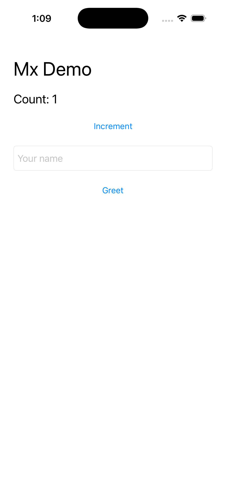
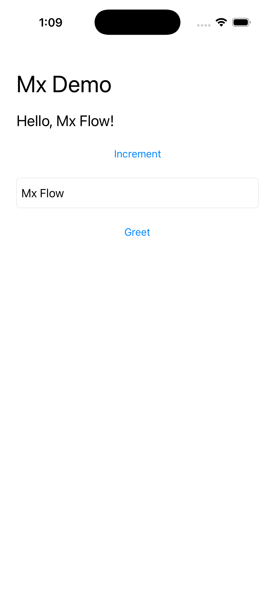

# Mx

**Build, run, and inspect iOS simulator apps from your terminal or AI agent.**

Mx is a Rust command-line tool and [Model Context Protocol](https://modelcontextprotocol.io/) server. It connects an agent to Xcode and the iOS Simulator so it can launch an app, read its interface, tap controls, enter text, collect logs, and capture screenshots.

The goal is a shorter loop between changing code and checking what actually happens on screen. Give agents repeatable access to a running app, with screenshots and assertions you can review.

Mx is an early project, version 0.1.0. It runs locally on macOS and requires Xcode. Simulator memory profiles are experimental.

## What you can do

| Task | What Mx provides |
| --- | --- |
| Build and run | Discover Xcode projects, build an app, and reuse the build across simulators. Relaunch an installed app without rebuilding or reinstalling. |
| Interact with the app | Find controls by accessibility identifier, label, or role. Tap, enter Unicode text, and verify expected labels. |
| Keep an agent session | Track the running app, read UI changes, reject stale references, and check the foreground app before sending input. |
| Capture a journey | Run named steps and save full-screen PNGs, semantic UI snapshots, and an HTML viewer. |
| Debug | Read structured build diagnostics and live logs with cursors. |
| Run several simulators | Create and clone devices, keep sessions separate, and check a memory budget before booting. |
| Explore lower memory use | Apply capability-aware service profiles to Mx-owned iOS 26.5 clones, verify changes, and restore them from a journal. |

Use the CLI directly or connect an MCP client to the same operations. Agent skills live in [skills/](skills/), with [`/mx`](skills/mx/SKILL.md) as the entry point.

## Screenshots

Real simulator captures from the included [UIKit demo](examples/MxDemo). Mx verified each expected label before saving its screenshot.

<p>
  
  
  
</p>

The sequence demonstrates launch, semantic input, label assertions, and screenshot capture. It is a test app, not a separate Mx graphical interface.

Mx also passed the same core workflow against Aroli, a separate SwiftUI app with package dependencies and multiple targets. It built, booted, installed, launched, entered text, tapped a control by accessibility semantics, verified the next screen, and captured the result. See the [real-world validation record](REAL_WORLD_VALIDATION.md).


## Benchmark results

Local measurements on Apple Silicon with Xcode 26.5, iOS 26.5, and AXe 1.8.0. These are demo results, not guarantees for every app or Mac.

| Measurement | Result | Practical meaning |
| --- | --- | --- |
| Installed-app relaunch, 20 runs | **235 ms median** | Restart a session without a build or install. |
| Three-state capture flow, 20 runs | **2.63 s median**, 3.57 s p95 | Capture three verified screens and write the journey artifacts. Relaunch is timed separately. |
| Simulator idle footprint, stock → slim | **3,429 → 1,077 MiB**, 68.6% lower | Optional services account for much of the measured idle footprint. |
| Simulator footprint after restore | **3,465 MiB** | Restoration returned the same simulator to its stock range. |

The slowest flow took 6.26 seconds. Memory results came from two exploratory stock/slim/restored cycles on a 16 GiB host, with ten samples per phase. Footprint sums simulator process accounting; it is not a measurement of unique system RAM saved. Profiles can disable services an app needs, so validate the capabilities your app uses.

Two slim simulators completed concurrent Unicode input and screenshot workflows. Higher fleet density has not been demonstrated on this host.

See [benchmark samples, methodology, and reproduction commands](benchmarks/README.md).

## Try it

You need macOS, Xcode with an installed iOS Simulator runtime, and Rust 1.89 or later. The setup script downloads AXe 1.8.0 and checks its SHA-256. Mx does not require Python. The installer needs at least 2 GiB free on the build volume and 100 MiB free in your home directory. Simulator runtimes and app builds need additional space.

```sh
git clone https://github.com/pol-cova/mx.git
cd mx
sh scripts/install.sh

mx devices
mx doctor
```

The installer puts `mx` in Cargo's bin directory and AXe in `~/Library/Application Support/Mx/tools/`. Mx discovers AXe and stores sessions automatically. No environment exports are needed. If `mx` is not on your shell's PATH, use the full executable path printed by the installer.

Choose a simulator UDID from that output, then replace `SIMULATOR_UDID` below:

```sh
mx run --project examples/MxDemo --scheme MxDemo --device SIMULATOR_UDID --inspect-ui
mx ui --device SIMULATOR_UDID
mx tap --device SIMULATOR_UDID --id increment
mx observe --device SIMULATOR_UDID
mx screenshot --device SIMULATOR_UDID
```

Use your own project path and scheme to work with your app. `mx --help` lists commands; `mx COMMAND --help` explains an individual command. Keep AXe's bundled frameworks beside its executable.

### Capture a complete flow

Edit the `device` field in [examples/demo-flow.json](examples/demo-flow.json) to match your simulator. Start the demo at its initial state, then capture the journey:

```sh
mx relaunch --device SIMULATOR_UDID
mx capture-flow examples/demo-flow.json
```

The plan taps Increment, enters a name, and taps Greet. Mx saves three PNGs, `flow.json`, and `flow.html` under `.mx/demo-flow/`. Use a fresh output directory for another capture.

### Connect your AI agent

Generate the configuration for your installation:

```sh
mx mcp-config
```

Copy the JSON output into your MCP client's server configuration. It includes the absolute path to your installed executable, so desktop clients do not need your shell's PATH. Mx discovers AXe automatically.

For a custom installation, `MX_AXE_PATH` overrides AXe discovery and `MX_STATE_DIR` overrides session storage. `mx mcp-config` includes those overrides when set. Otherwise, Mx checks its managed AXe installation, then `axe` on PATH.

The server communicates over stdio. Clients discover the full tool catalog through MCP `tools/list`. Start an app with `mx_run`, or attach to an existing session with `mx_use_session`, before interacting with it.

An example task to give your agent:

> Run MxDemo, increment the counter, enter "Hola, José", and verify the greeting. Save screenshots of the initial state and the result.

## Validation status

The automated Rust suite uses fake Xcode and simulator tools for many behavior checks. Those tests verify Mx's logic, but they do not prove that installation or a real app works on a particular Mac.

The published benchmark samples and screenshots come from live MxDemo simulator runs. MxDemo is a small UIKit test app. Compatibility with a larger production app is not established by those results.

The automatic-discovery installer and Aroli validation status are recorded in [REAL_WORLD_VALIDATION.md](REAL_WORLD_VALIDATION.md). See [CONTRIBUTING.md](CONTRIBUTING.md) for the distinction between automated and live checks.

## Contribute

Bug reports, reproducible benchmarks, and pull requests are welcome. Start with [CONTRIBUTING.md](CONTRIBUTING.md). Useful areas include accessibility edge cases, testing profiles against more apps, and reducing capture latency.

[Open an issue](https://github.com/pol-cova/mx/issues) with your environment, the command you ran, and what happened. Remove private app data from logs and screenshots before sharing them.

## License and credits

Mx's original code is [MIT licensed](LICENSE), copyright 2026 Paul Contreras. You can use, modify, and redistribute it, including commercially, while retaining the required copyright and license notices.

The runtime catalog includes mappings derived from [simslim](https://github.com/MobAI-App/simslim), also under MIT. Its original copyright and license remain in [third-party/mx-runtime-seed/](third-party/mx-runtime-seed/).

Mx uses [AXe](https://github.com/cameroncooke/AXe) for simulator accessibility. AXe 1.8.0 is MIT licensed and downloaded separately. Rust dependencies retain their own licenses. Xcode, Apple SDKs, and simulator runtimes are separate Apple tools and are not distributed here.

See [THIRD_PARTY_NOTICES.md](THIRD_PARTY_NOTICES.md) for attribution and distribution notes.
