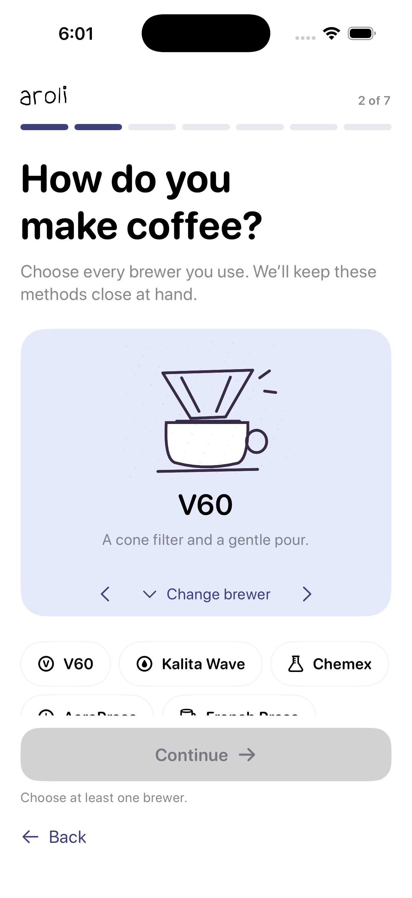

# Mx

Mx lets an AI agent build, run, inspect, and control iOS apps in the Simulator.

It is a Rust CLI and MCP server for macOS. Mx uses Xcode, CoreSimulator, and the accessibility tree. An agent can build an app, tap controls by label or identifier, enter text, read logs, verify UI state, and save screenshots.

Mx is at version 0.1.0. It has been tested with MxDemo and Aroli, a SwiftUI app with iPhone and Watch targets. Fleet profiles are experimental. The numbers below came from one Mac.

## Benchmarks

Tests ran on a 16 GiB Apple Silicon Mac with Xcode 26.5, iOS 26.5, and AXe 1.8.0.

| Test | Result | Scope |
| --- | ---: | --- |
| Relaunch an installed app | 235 ms median | 20 MxDemo runs |
| Capture three verified screens | 2.63 s median, 3.57 s p95 | 20 MxDemo runs |
| Slim simulator idle memory | 3,429 MiB to 1,077 MiB | Two stock, slim, and restore cycles |
| Restore simulator profile | 3,465 MiB after restore | Returned to the stock range |
| Current slim simulator idle | 832 MiB median | 10 samples; 832–843 MiB |
| Aroli with keyboard visible | 812 MiB median | 10 samples; 812–814 MiB |
| Two simulators idle | 1,840 MiB combined median | 10 samples; 1,840–1,842 MiB |
| Two simulators with apps running | 2,245 MiB combined median | 10 samples; 2,245–2,253 MiB |
| Concurrent app workflow | 11.05 s | Unicode input and screenshots on both simulators |

The latest single-simulator run reached the 800–850 MiB idle goal. The keyboard-active Aroli sample was lower because foregrounding the app changed the running process mix.

The earlier process cleanup lowered the two-simulator medians from 2,329 to 1,840 MiB idle and from 2,807 to 2,245 MiB with both demo apps running. That is about 21% and 20% lower than the older fleet run. Mx stopped both simulators afterward.

The memory number is the summed physical footprint of each simulator's process tree. It is useful for comparing the same machine and workload. It is not the amount of unique system RAM saved.

SpringBoard, the wallpaper extension, BackBoard, and the accessibility server remain because the simulator and semantic UI control need them. The widget renderer restarted after termination, so Mx leaves it alone. The slim profile removes optional Spotlight, Watch, health, and device-management agents. It also stops idle audio and Metal compiler helpers after boot; those helpers restart when needed. InputUI returned for the Aroli keyboard test and is included in the active result.

The fleet run covered two concurrent simulators. A six-device run ended during device creation when the disk filled, so capacity beyond two is unmeasured. Mx checks memory before booting another simulator.

The raw flow and memory samples are in [benchmarks](benchmarks/README.md).

## Aroli

Mx also ran against Aroli, a SwiftUI project with package dependencies and iPhone and Watch targets.

It discovered the Xcode project, built the `Aroli` scheme, booted an iPhone 17 Pro simulator, installed the app, and launched it. Mx read the accessibility tree, entered a name, tapped `Continue` by label and role, and checked that onboarding moved from step 1 to step 2.

The first run took 46.0 seconds. The build took 22.5 seconds and the simulator boot took 9.3 seconds. Mx returned four Swift concurrency warnings from the build as structured diagnostics.



## What Mx does

- Discovers Xcode projects, workspaces, schemes, and simulators.
- Builds, installs, launches, relaunches, and stops apps.
- Reads semantic UI state and tracks changes between revisions.
- Taps controls and enters ASCII or Unicode text.
- Checks the foreground app before sending input.
- Returns structured build warnings and errors.
- Reads live logs with bounded cursors.
- Captures screenshots and named multi-screen flows.
- Creates isolated simulators and keeps their sessions separate.
- Applies reversible service profiles to Mx-owned iOS 26.5 simulators.
- Checks simulator count and memory headroom before booting another device.

## Install

You need macOS, Xcode with an iOS Simulator runtime, and Rust 1.89 or later.

```sh
git clone https://github.com/pol-cova/mx.git
cd mx
sh scripts/install.sh
mx doctor
```

The installer downloads AXe 1.8.0, verifies its checksum, and builds Mx. Mx finds AXe and its session directory automatically. You do not need to export their paths.

If the checkout is on a small disk, put Rust build output on another volume:

```sh
CARGO_TARGET_DIR=/path/with/free/space sh scripts/install.sh
```

## Run an app

List simulators:

```sh
mx devices
```

Choose a simulator UDID and run the included app:

```sh
mx run \
  --project examples/MxDemo \
  --scheme MxDemo \
  --device SIMULATOR_UDID \
  --inspect-ui

mx tap --device SIMULATOR_UDID --id increment
mx observe --device SIMULATOR_UDID
mx screenshot --device SIMULATOR_UDID
```

Use your own project path and scheme to run another app.

See [the two-minute demo](DEMO.md) for a prepared walkthrough.

## Connect an agent

Generate the MCP configuration for the installed executable:

```sh
mx mcp-config
```

Copy the JSON into your MCP client. The generated command uses the absolute path to Mx, so it does not depend on the client's shell path.

The agent can then make a request such as:

> Build this iOS app, launch it in the simulator, complete the first screen using accessibility controls, verify the result, and save a screenshot.

The [`/mx`](skills/mx/SKILL.md) skill gives an agent instructions for app work, flow capture, diagnostics, and simulator performance.

## Tests

The repository has 61 passing Rust tests. Test executables stand in for Xcode and AXe where a test needs repeatable errors, cancellation, or concurrent requests. The benchmark table and Aroli run use CoreSimulator and AXe.

See [CONTRIBUTING.md](CONTRIBUTING.md) before submitting a change.

## License

Mx is available under the [MIT License](LICENSE).

The simulator service catalog contains mappings derived from [simslim](https://github.com/MobAI-App/simslim), also under MIT. Mx downloads [AXe](https://github.com/cameroncooke/AXe), which uses the MIT License. Xcode and simulator runtimes remain subject to Apple's terms.

See [THIRD_PARTY_NOTICES.md](THIRD_PARTY_NOTICES.md) for the retained notices.
